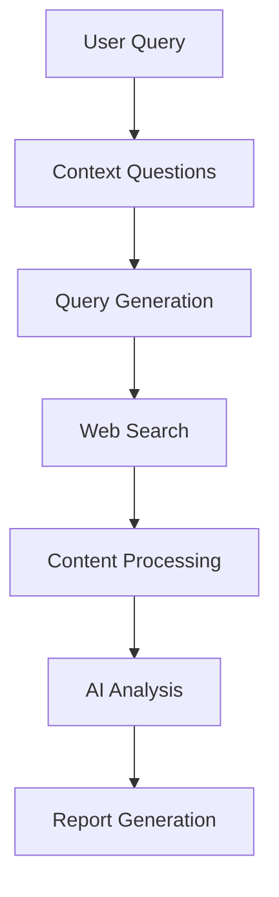

# 🔬 DeepResearch AI

<div align="center">

[](https://www.typescriptlang.org/)
[](https://nodejs.org/)
[](https://deepmind.google/technologies/gemini/)
[](https://opensource.org/licenses/MIT)

> Your AI-powered research companion that transforms complex queries into comprehensive insights.

[Features](#-features) • [Installation](#-installation) • [Usage](#-usage) • [Architecture](#-architecture) • [Contributing](#-contributing)

</div>

## 🌟 Features

### 🤖 AI-Powered Research
- **Contextual Understanding**: Asks clarifying questions to understand your research needs
- **Smart Query Generation**: Uses Gemini Pro to create targeted search queries
- **Deep Web Analysis**: Scrapes and analyzes multiple sources for comprehensive insights
- **Intelligent Processing**: Handles rate limits and large content chunks efficiently

### 📊 Smart Output
- **Executive Summaries**: Concise overview of key findings
- **Structured Analysis**: Categorized insights and detailed breakdowns
- **Source Tracking**: Complete transparency with cited sources
- **Markdown Reports**: Clean, formatted reports saved automatically

### 🛡️ Enterprise-Grade Features
- **Rate Limit Protection**: Smart retry system with exponential backoff
- **Token Management**: Efficient handling of API token limits
- **Error Resilience**: Graceful handling of API and network issues
- **Progress Tracking**: Real-time updates on research progress

## 🚀 Installation

```bash
# Clone the repository
git clone https://github.com/Shasvinth/DeepResearch-AI.git

# Navigate to project
cd DeepResearch-AI

# Install dependencies
npm install

# Set up environment
cp .env.example .env.local
```

### 🔑 API Keys Setup
1. Get your [Google AI (Gemini Pro) API key](https://makersuite.google.com/app/apikey)
2. Get your [Firecrawl API key](https://firecrawl.co/dashboard)
3. Add to `.env.local`:
   ```env
   GOOGLE_API_KEY="your_gemini_key"
   FIRECRAWL_KEY="your_firecrawl_key"
   ```

## 🎮 Usage

```bash
npm start
```

### 📝 Example Research Flow

1. **Start Your Research**
   ```
   What would you like to research?
   > Latest advancements in quantum computing
   ```

2. **Set Parameters**
   - Breadth (3-10): How many angles to explore
   - Depth (1-5): How deep to analyze each angle

3. **Answer Context Questions**
   ```
   What specific aspects of quantum computing interest you most?
   > Focus on error correction and scalability
   ```

4. **Get Comprehensive Results**
   - Executive Summary
   - Key Findings
   - Detailed Sources

## 🏗️ Architecture



### 📁 Project Structure
```
src/
├── core/           # Core business logic
├── models/         # AI model integrations
├── utils/          # Utility functions
└── tests/          # Test suites
```

## 🤝 Contributing

Contributions are welcome! Here's how you can help:

1. 🍴 Fork the repository
2. 🌿 Create your feature branch
   ```bash
   git checkout -b feature/AmazingFeature
   ```
3. 💾 Commit your changes
   ```bash
   git commit -m 'Add some AmazingFeature'
   ```
4. 📤 Push to the branch
   ```bash
   git push origin feature/AmazingFeature
   ```
5. 🔄 Open a Pull Request

## 📈 Future Roadmap

- [ ] Multi-model support (Claude, GPT-4)
- [ ] Custom search providers
- [ ] Interactive research mode
- [ ] Citation formats
- [ ] Research history tracking
- [ ] Export to multiple formats

## 📄 License

MIT © Shasvinth Srikanth

---

<div align="center">

**[GitHub](https://github.com/Shasvinth)** • **[Twitter](https://x.com/ShasvinthS)**

Made with ❤️ by Shasvinth Srikanth

</div>
